# IAD 通用工业瑕疵质检系统操作手册

> 文档版本：V1.0  
> 更新日期：2026-08-10  
> 适用程序：IAD `master` 分支，提交 `6ceb320` 及之后版本  
> 运行方式：Windows x64，本地 SQLite + 本地 Workspace

## 1. 文档用途

本手册说明 IAD 当前已经完成的功能、推荐业务流程、各页面的具体操作方法、数据保存位置和常见问题。

当前系统已形成两条可以实际运行的本地闭环：

1. 产品定义 → 图片导入 → 人工标注/Mask → 审核与划分 → 数据集版本 → 模板辅助识别 → 标注回写。
2. ONNX 模型导入 → CPU 离线推理 → Recipe 规则判定 → 检测结果保存 → 条件追溯与 CSV 导出。

当前“在线检测”页面执行的是本地图片离线检测，不代表相机、PLC、MES 已经接入生产线。

## 2. 当前功能完成情况

| 模块 | 当前状态 | 已完成的主要能力 |
| --- | --- | --- |
| 产品定义 | 可用 | 产品新建/切换、基本信息、产品定义版本、基准图、定位参数配置、尺寸标定、瑕疵类别、CSV 导入导出、ROI 管理 |
| 数据集标注 | 可用 | 图片/文件夹导入、SHA-256 去重、矢量标注、像素 Mask、编辑、撤销重做、质量检查、审核、数据划分、版本发布与恢复 |
| 数据集交换 | 可用 | COCO、YOLO Detection、YOLO Segmentation、分类别 Mask PNG 导入导出 |
| 瑕疵模板识别 | 基础闭环可用 | 从已有标注构建正样本、CPU 原型匹配、候选生成、Top-K/NMS、边缘框精修、确认回写、拒绝、Hard Negative |
| ONNX 模型库 | 可用 | 模型校验、复制归档、SHA-256、类别顺序、输入尺寸、阈值、启用、安全删除 |
| 规则与 Recipe | 可用 | Recipe 绑定模型、类别规则、阈值/尺寸/数量判定、保存和启用 |
| 图片离线检测 | 可用 | 多图片/文件夹队列、ONNX Runtime CPU 推理、分类/YOLO 输出解析、停止、结果和标注图预览、CSV 导出 |
| 结果追溯 | 可用 | 日期、状态、类别、Recipe、关键字查询；详情、标注图、规则说明、错误和耗时回看；CSV 导出 |
| 训练任务 | 未完成 | 当前只保留训练配置、任务和验收页面框架；训练 Worker 未接入 |
| 真实产品定位 | 未完成 | 定位参数和 ROI 可以保存，但 HALCON/真实定位算法尚未接入 |
| 产线联机 | 未完成 | 相机、PLC、MES、节拍控制和联机权限尚未接入 |
| 系统设置 | 页面框架 | 设置页面主要用于展示规划结构，尚未形成完整的配置执行闭环 |

## 3. 推荐完整业务流程

```mermaid
flowchart LR
    A["选择或新建产品"] --> B["定义瑕疵类别与 ROI"]
    B --> C["导入数据集图片"]
    C --> D["矢量标注或像素 Mask"]
    D --> E["质量检查与审核"]
    E --> F["Train / Validation / Test 划分"]
    F --> G["发布数据集版本"]
    G --> H["外部训练并导出 ONNX"]
    H --> I["导入并启用 ONNX 模型"]
    I --> J["配置并启用 Recipe"]
    J --> K["执行图片离线检测"]
    K --> L["保存结果与标注图"]
    L --> M["结果追溯与 CSV 导出"]
```



推荐第一次使用时严格按以下顺序操作：

1. 新建产品并保存产品定义。
2. 为产品定义至少一个启用状态的瑕疵类别。
3. 导入数据集图片并完成标注。
4. 对有缺陷图片执行“审核通过”，对无缺陷图片执行“确认正常”。
5. 在“数据集管理”中完成 Train / Validation / Test 划分并发布版本。
6. 使用导出的数据在外部训练环境完成训练并导出 ONNX。
7. 在“训练与模型”页面导入并启用 ONNX。
8. 在“规则与 Recipe”页面绑定模型、设置规则并执行“保存并启用”。
9. 在“在线检测”页面导入待检图片并执行离线检测。
10. 在“结果追溯”页面查询、回看并导出结果。

## 4. 安装、构建与启动

### 4.1 运行要求

- Windows x64。
- Visual Studio，安装“.NET 桌面开发”工作负载。
- .NET Framework 4.7.2 Developer Pack。
- NuGet 包还原可访问网络。
- 项目平台必须选择 `x64`，不能使用 `Any CPU`。

### 4.2 Visual Studio 启动步骤

1. 使用 Visual Studio 打开仓库根目录的 `IAD.sln`。
2. 在解决方案配置中选择 `Debug` 或 `Release`。
3. 在解决方案平台中选择 `x64`。
4. 右键解决方案，执行“还原 NuGet 程序包”。
5. 执行“生成解决方案”。
6. 将 `IAD` 设置为启动项目并运行。

首次还原 Microsoft.ML.OnnxRuntime 时会下载较大的 CPU 原生运行库，等待时间可能明显长于普通构建。

### 4.3 当前登录行为

当前开发版本保留了登录窗体和会话框架，但启动时暂时跳过登录页并直接进入主界面。正式部署前仍需恢复身份认证和角色权限。

## 5. Workspace 数据目录

程序首次运行时，会在可执行文件同级建立 `Workspace`：

```text
Workspace/
├─ project.db       # SQLite 业务数据库
├─ Images/          # 数据集图片副本
├─ Masks/           # 像素级 Mask PNG
├─ Templates/       # 模板资源
├─ Models/          # 导入后的 ONNX 模型
├─ TrainingRuns/    # 训练任务预留目录
├─ Results/         # 检测原图和标注图
├─ Logs/            # 日志目录
└─ Cache/           # 缓存目录
```

重要说明：

- 产品、类别、ROI、图片索引、标注、Recipe、规则和检测记录保存在 `project.db`。
- 图片、Mask、模型和检测结果保存在对应文件目录。
- 备份时必须整体备份 `Workspace`，只复制数据库会丢失模型和图片文件。
- 不建议人工修改 `project.db` 或移动 Workspace 内部文件。
- Debug 与 Release 的可执行文件目录不同，因此可能分别形成独立 Workspace。

## 6. 当前产品上下文

产品定义、数据集标注、模板识别、模型、Recipe、离线检测和结果追溯都使用同一个“当前产品”。

操作原则：

1. 先进入“产品定义”。
2. 点击“切换 / 新建产品”。
3. 选择目标产品或新建产品。
4. 确认页面上显示的产品编号和名称正确。
5. 再进入其他业务页面。

切换产品后：

- 瑕疵类别、ROI、数据集图片、标注、Mask、模型和 Recipe 会切换到该产品的数据。
- 不同产品的数据彼此隔离。
- 离线检测只能使用当前产品已启用的 Recipe 和其绑定模型。

## 7. 产品定义

### 7.1 新建产品

1. 打开“产品定义”。
2. 点击“切换 / 新建产品”。
3. 在产品选择窗口中选择新建产品。
4. 填写“产品名称”和“产品编号”。
5. 根据实际情况填写图像尺寸、单图产品数、姿态和采集条件。
6. 点击“保存产品定义”。

注意：

- 产品编号不能为空，并且不能与已有产品重复。
- 单图产品数必须大于 0。
- 产品首次保存后，才能导入基准图、维护 ROI 和保存瑕疵类别。

### 7.2 切换产品

1. 点击“切换 / 新建产品”。
2. 在列表中选择已有产品。
3. 确认产品编号、产品名称和版本提示已经变化。

切换产品会通知其他页面刷新当前产品数据。

### 7.3 产品基本信息

可维护字段包括：

| 字段 | 说明 |
| --- | --- |
| 产品名称 | 面向操作人员显示的产品名称 |
| 产品编号 | 产品唯一编号 |
| 图像尺寸 | 说明性图像尺寸，例如 `2448 × 2048 px` |
| 单图产品数 | 一张图片包含的产品数量，必须大于 0 |
| 姿态 | 产品是否允许旋转等姿态说明 |
| 采集条件 | 相机、光照、背景等说明 |

修改后点击“保存产品定义”。

### 7.4 基准图和 ROI

1. 点击“导入基准图”。
2. 选择一张能够代表正常产品外观的图片。
3. 图片会复制到 Workspace，并在页面中预览。
4. 点击“管理 ROI”。
5. 新建或修改矩形 ROI，填写 ROI 名称、位置、宽度、高度、角度和顺序。
6. 保存 ROI 并返回产品定义页面。

“清空 ROI”会删除当前产品的全部 ROI，操作前应确认不再需要这些区域。

当前 ROI 和定位参数可以持久化，但真实 HALCON 定位和模板算子尚未接入。“测试定位（待接）”不能作为产线定位验收依据。

### 7.5 定位参数

可保存以下配置：

- 定位方式。
- 模型类型。
- 最小匹配分数，范围为 0～1。
- 角度范围。
- 缩放范围。
- 匹配数量，必须大于 0。

页面提供“快速模式”“精细模式”“自动模式”参数预设。预设只会更新参数，不会执行真实定位。

“校验模板配置”用于检查基准图、ROI 和定位参数是否完整，不会生成真实 HALCON 模板。

### 7.6 尺寸标定

可保存：

- 像素尺寸 X。
- 像素尺寸 Y。
- 长度单位。
- 面积单位。
- 标定版本。
- 标定状态。

像素尺寸 X、Y 必须大于 0。当前离线检测结果的矩形坐标、宽高和面积仍按图像像素记录，标定配置主要作为产品定义和后续工业测量扩展基础。

### 7.7 瑕疵类别管理

每个 ONNX 模型标签和 Recipe 规则都依赖产品瑕疵类别，因此必须先完成类别定义。

新建类别：

1. 点击“新增类别”。
2. 系统会自动分配新的类别编号；在表格中填写类别名称、瑕疵类型和检测策略。
3. 填写默认阈值、最小面积、最小长度和状态。
4. 编辑完成后类别会自动保存，也可以点击“保存当前类别”。

字段说明：

| 字段 | 说明 |
| --- | --- |
| 类别编号 | 模型标签映射的稳定编码；页面新增时自动生成，如需使用 `SCRATCH` 等自定义编码，可通过类别 CSV 导入 |
| 类别名称 | 页面显示名称，例如“划痕” |
| 瑕疵类型 | 表面、尺寸、装配等说明 |
| 检测策略 | 人工、分类、检测等说明 |
| 默认阈值 | 新建 Recipe 规则时的默认置信度，范围 0～1 |
| 最小面积 | 默认最小面积，不能为负数 |
| 最小长度 | 默认最小宽度，不能为负数 |
| 状态 | 只有启用类别会进入主要标注和 Recipe 流程 |

其他操作：

- “启用 / 停用”：切换类别状态。
- “删除类别”：删除当前产品类别；已有历史标注仍保留快照名称，但不建议随意删除已投入使用的类别。
- “导入配置”：从 CSV 批量导入类别。
- “导出配置”：将类别导出为 CSV，便于备份或复制配置。

### 7.8 保存产品定义

完成基本信息、定位参数、标定和类别配置后点击“保存产品定义”。保存时会同时执行主要字段校验，并更新产品定义版本信息。

## 8. 数据集标注

### 8.1 前置条件

进入“数据集标注”前，应确认：

1. 已选择当前产品。
2. 产品定义已经保存。
3. 当前产品至少有一个启用的瑕疵类别。

页面顶部会显示当前产品编号、名称和产品定义版本。

### 8.2 导入图片文件

1. 点击“导入文件”。
2. 一次选择一张或多张图片。
3. 等待后台导入完成。
4. 导入过程中会显示进度，可点击“取消导入”。

系统会：

- 将图片复制到当前程序的 `Workspace/Images`。
- 计算 SHA-256 内容哈希。
- 同一产品下，如果文件内容已经存在，则跳过重复图片。
- 内容去重不依赖文件名和原始路径。

### 8.3 导入图片文件夹

1. 点击“导入文件夹”。
2. 选择图片目录。
3. 系统会递归扫描子目录并导入支持的图片。

也可以把文件或文件夹直接拖入数据集标注页面。

### 8.4 选择和删除图片

- 单击图片列表切换当前图片。
- 使用 `Ctrl` 或 `Shift` 多选图片。
- 点击“删除图片”或按 `Delete` 删除选中图片。

删除前会显示关联的矢量标注和 Mask 数量。未被历史版本引用的文件会清理；被历史版本引用的文件会保留，以免破坏版本快照。

### 8.5 选择瑕疵类别

在右侧或顶部类别列表中选择当前标注类别。类别来自当前产品定义。

- 数字键 `1`～`9` 可以快速选择前九个类别。
- 切换类别后，新建矢量标注或 Mask 会保存到该类别。

### 8.6 矩形标注

1. 选择瑕疵类别。
2. 点击“矩形”。
3. 在图片上按住鼠标左键，从矩形一个角拖到另一个角。
4. 松开鼠标后标注自动保存到 SQLite。

### 8.7 多边形标注

1. 选择瑕疵类别。
2. 点击“多边形”。
3. 单击依次添加顶点。
4. 双击或按 `Enter` 完成多边形。
5. 按 `Backspace` 删除最后一个未完成顶点。
6. 按 `Esc` 或单击鼠标右键取消当前未完成多边形。

### 8.8 画笔矢量标注和橡皮擦

1. 选择“画笔”。
2. 设置线宽。
3. 在图片上按住左键绘制轨迹。
4. 松开后轨迹保存为 Brush 类型矢量标注。

“橡皮擦”用于删除命中的矢量标注。执行删除前应确认当前没有误选重要标注。

### 8.9 编辑已有标注

1. 点击“编辑标注”。
2. 单击已有标注将其选中。
3. 拖动标注内部可整体移动。
4. 矩形会显示 8 个控制点，可拖动四角或四边缩放。
5. 多边形可拖动单个顶点。
6. Brush 标注支持整体移动。
7. 按 `Delete` 删除选中的标注。

每次有效修改都会写回数据库。

### 8.10 复制、粘贴和批量改类

- `Ctrl+C`：复制当前选中的矢量标注。
- `Ctrl+V`：粘贴标注到当前图片。
- “批量改类”：将当前图片中选定类别的标注批量修改为其他类别。

批量改类前应确认目标类别正确。

### 8.11 撤销与重做

- `Ctrl+Z`：撤销。
- `Ctrl+Y`：重做。

支持新增、删除、移动、矩形缩放、多边形顶点编辑和当前 Mask 修改。操作历史属于当前运行会话，不会跨应用重启保存。

### 8.12 缩放和平移

- 鼠标滚轮：以鼠标位置为中心缩放。
- 鼠标中键拖动：平移画布。
- 按住 `Space` 再用左键拖动：平移画布。
- `Home` 或数字键 `0`：恢复适配显示。
- `PageUp` / `PageDown`：切换上一张/下一张图片。
- `Alt+左方向键` / `Alt+右方向键`：切换图片。

### 8.13 像素 Mask 编辑

Mask 的数据结构为“图片 × 瑕疵类别 = 一张二值 Mask”。同一图片的不同类别分别保存 Mask PNG。

进入 Mask 模式：

1. 选择图片。
2. 选择瑕疵类别。
3. 点击“Mask 编辑”。

Mask 工具：

- “增加”：左键涂抹前景。
- “擦除”：擦除前景；也可以直接使用鼠标右键擦除。
- “由矢量生成”：把当前类别的 Rectangle、Polygon、Brush 栅格化成 Mask；已有 Mask 会被覆盖。
- “边缘精修”：以现有少量前景为种子，使用 CPU 颜色和连通区域算法扩展到边缘。
- “撤销”/“重做”：撤销或重做 Mask 操作。
- “清空”：清除当前图片当前类别的 Mask。
- “退出”：退出 Mask 模式。

Mask 每次笔划结束后会保存为 8-bit 二值 PNG，背景为 0，前景为 255。

CPU 边缘精修是无外部模型的辅助功能，结果需要人工检查，不能代替深度分割模型的现场验收。

### 8.14 边界检查

点击“边界检查”后：

- Rectangle 会与图像范围求有效交集。
- Polygon 会按图像边界裁剪。
- Brush 会考虑笔刷半径，限制实际笔迹范围。
- 无法自动修复的标注会列出编号、类别和原因，需要人工编辑或删除。

### 8.15 标记正常与审核通过

当前图片没有瑕疵时：

1. 确认没有残留矢量标注和 Mask。
2. 点击“确认正常”。

当前图片标注完成时：

1. 检查类别和几何范围。
2. 点击“审核通过”。

标注内容被修改后，图片会自动回到待审核状态，需要重新审核。

### 8.16 数据集管理：审核与划分

点击“数据集管理”，在“审核与划分”页可以：

- 多选图片后执行“标记正常”。
- 执行“审核通过”。
- 执行“驳回”。
- 执行“忽略”。
- 执行“重置待审核”。
- 手工设为 Train、Validation 或 Test。
- 设置训练集比例、验证集比例和随机种子后执行自动划分。

自动划分规则：

- Train 比例 + Validation 比例不能超过 100%。
- 剩余比例进入 Test。
- 相同数据、比例和随机种子会得到稳定划分结果。

### 8.17 数据质量检查

数据集管理会在后台检查：

- 越界几何。
- 空或无效几何。
- 重复标注。
- 类别最小面积。
- Mask 是否为空。
- Mask 文件是否存在。
- Mask 尺寸是否与原图一致。
- 正常图片是否残留缺陷标注。

启用质量门禁导出时，存在阻断问题的数据不能作为合格训练集导出。

### 8.18 发布数据集版本

1. 返回数据集标注页面。
2. 点击“发布版本”。
3. 填写版本说明。
4. 点击“发布”。

版本快照包含：

- 图片。
- 矢量标注。
- Mask 元数据和不可变 PNG 路径。
- 审核状态。
- Train / Validation / Test 划分。
- 产品定义版本。

发布后继续修改当前工作集不会覆盖历史版本。

### 8.19 导入和导出训练格式

在“数据集管理 → 版本与导出”中：

1. 选择输出目录。
2. 选择 COCO、YOLO 和 Mask 输出项。
3. 可选择“只导出已审核数据”。
4. 可启用质量门禁。
5. 点击“导出当前工作集”或“导出选中历史版本”。

支持输出：

- COCO JSON。
- YOLO Detection 标签。
- YOLO Segmentation 标签。
- 分类别 Mask PNG。
- `dataset.yaml`。

回流导入：

- “导入 COCO”：选择 COCO 标注 JSON。
- “导入 YOLO/Mask”：选择 YOLO 数据集目录。
- 如果导入文件包含当前产品不存在的类别，系统会自动建立类别。

### 8.20 比较和恢复历史版本

比较版本：

1. 在版本列表选择两个版本。
2. 点击“比较两个版本”。
3. 查看图片、标注和 Mask 的增加或减少数量。

恢复版本：

1. 选择一个历史版本。
2. 点击“恢复选中版本”。
3. 阅读确认提示后执行恢复。

恢复会替换当前工作集，请在操作前确认当前未发布内容是否仍需保留。

## 9. 瑕疵模板识别

### 9.1 适用场景

模板识别用于根据少量已有标注生成相似候选，帮助扩充标注，不是最终 ONNX 检测模型。

### 9.2 前置条件

1. 已选择产品。
2. 产品有启用的瑕疵类别。
3. 数据集中已经存在该类别的人工确认标注，作为正样本。

### 9.3 生成候选

1. 进入“瑕疵模板识别”。
2. 选择瑕疵类别。
3. 查看正样本数量和难负样本数量。
4. 设置相似度阈值和 Top-K。
5. 点击“生成识别候选”。
6. 等待 CPU 原型匹配完成。

系统使用灰度特征、类别原型、三尺度滑窗、已有标注排除和 NMS 生成候选。

### 9.4 处理候选

选择候选后可以：

- “边缘框精修”：根据局部图像边缘调整候选框。
- “确认并写入标注”：将候选作为真实标注写回数据集。
- “拒绝候选”：标记为误检。
- “加入难负样本”：将误检区域加入 Hard Negative，后续对相似候选降分。

候选确认后，应返回“数据集标注”检查类别和几何，并重新执行审核。

## 10. ONNX 模型导入与模型库

### 10.1 前置条件

1. 已选择产品。
2. 当前产品的瑕疵类别已经定义并启用。
3. 已从外部训练环境导出 `.onnx` 文件。

### 10.2 当前支持的模型约定

输入：

- 一个主要 `float` 图像输入。
- 四维 `NCHW` 张量。
- 3 通道 RGB。
- 像素归一化到 0～1。
- 静态输入尺寸自动读取；动态尺寸未填写时默认使用 640 × 640。

输出：

- `Classification`：分类分数或 Logits 向量。
- `YoloV5`：`[1,N,5+C]`。
- `YoloV8`：`[1,N,4+C]` 或 `[1,4+C,N]`。
- 输出必须是 float 张量。

当前不支持：

- 分割 Mask 输出。
- 多输入模型。
- 自定义 mean/std。
- 非标准输出后处理。
- CUDA 或 TensorRT Execution Provider。

### 10.3 导入模型

1. 进入“训练与模型”。
2. 在模型库区域点击“导入 ONNX”。
3. 选择 `.onnx` 文件。
4. 填写模型编号、模型名称和版本。
5. 选择输出格式：`Classification`、`YoloV5` 或 `YoloV8`。
6. 输入尺寸填写 0 时优先从模型读取；动态模型无法读取时使用 640。
7. 填写模型级置信度阈值。
8. YOLO 模型填写 NMS 阈值。
9. 按模型训练时的类别索引顺序填写类别。
10. 根据需要勾选“导入后立即启用”。
11. 点击“导入”。

导入过程中会实际创建 ONNX Runtime Session，检查输入输出，并将模型复制到 `Workspace/Models`。

### 10.4 类别顺序填写规则

类别顺序必须与训练和导出 ONNX 时完全一致。

YOLO 示例：

```text
SCRATCH
DIRT
NOTCH
```

Classification 示例：

```text
normal
SCRATCH
DIRT
NOTCH
```

分类模型中的正常类别可以使用：`normal`、`ok`、`正常` 或 `良品`。正常类别不会生成缺陷实例。

除正常类别外，每一个标签都必须能匹配当前产品的类别编号或类别名称。存在未知类别时会拒绝导入，避免模型类别和标注类别错位。

分类模型输出类别数必须与填写的类别数相同。

### 10.5 模型级阈值

- 模型级置信度阈值在输出解析阶段首先执行。
- 低于模型阈值的预测不会进入 Recipe。
- Recipe 的最低置信度不能找回已经被模型阈值过滤的预测。
- 建议模型阈值设置为较宽松的候选阈值，再通过 Recipe 做业务判定。

### 10.6 启用模型

1. 在模型库中选择模型。
2. 点击“设为启用”。

每个产品可以保存多个模型，但同一产品只有一个模型标记为当前启用。Recipe 仍会保存明确的模型 ID，因此实际检测以已启用 Recipe 绑定的模型为准。

### 10.7 删除模型

1. 选择模型。
2. 点击“删除模型”。
3. 确认删除。

如果模型已被任何 Recipe 引用，系统会阻止删除。应先切换或修改相关 Recipe。

## 11. Recipe 规则配置

### 11.1 新建 Recipe

1. 进入“规则与 Recipe”。
2. 点击“新建”。
3. 填写 Recipe 名称。
4. 根据实际项目填写数据集版本、定位模板版本、规则版本、标定版本和阈值版本。
5. 在“推理模型”下拉框中选择 ONNX 模型。
6. 检查系统根据当前产品类别生成的规则行。

### 11.2 规则字段

| 字段 | 含义 |
| --- | --- |
| 瑕疵类别 | 当前产品类别，不能随意改成模型之外的类别 |
| 区域 | 当前版本使用全图规则 |
| 最低置信度 | 预测必须达到的 Recipe 置信度 |
| 最小面积 | 预测框最小像素面积 |
| 最小宽度 | 预测框最小像素宽度 |
| 最小高度 | 预测框最小像素高度 |
| 允许数量 | 该类别允许通过的最大合格数量 |
| 超限判定 | `NG`、`OK` 或 `IGNORE` |

数值要求：

- 最低置信度为 0～1。
- 面积、宽度、高度不能为负数。
- 允许数量不能为负数。

### 11.3 数量判定逻辑

执行顺序如下：

1. ONNX 输出先经过模型级置信度过滤。
2. 预测再检查 Recipe 的最低置信度、最小面积、最小宽度和最小高度。
3. 达到阈值的同类预测进行数量统计。
4. 当“实际数量 > 允许数量”时执行“超限判定”。

示例：

- 允许数量为 0，检测到 1 个合格划痕，超限判定为 NG，则整图 NG。
- 允许数量为 2，检测到 2 个合格污点，不超限，结果可以保持 OK。
- 超限判定为 IGNORE 时，即使数量超限也不触发 NG。
- 模型检测到未配置规则的未知类别时，系统按 NG 处理。

### 11.4 保存与启用

- “保存”：保存 Recipe 内容，不强制切换当前启用 Recipe。
- “保存并启用”：保存后把该 Recipe 设为当前产品唯一启用 Recipe。

开始离线检测前，必须保证：

1. Recipe 已绑定有效模型。
2. Recipe 已保存并启用。
3. 模型文件仍存在于 Workspace。

## 12. 图片离线检测

主界面中的页面名称为“在线检测”，但当前实际功能是本地图片离线检测。

### 12.1 检测前检查

页面右下或后端信息区应显示：

- Recipe：当前启用 Recipe 名称。
- Model：绑定的模型版本和类型。
- Backend：ONNX Runtime。
- Device：CPU x64。

如果显示“未启用”或“未绑定”，返回“规则与 Recipe”完成配置。

### 12.2 导入单张或多张图片

1. 点击“加载图片”或页面现有的图片导入按钮。
2. 一次选择一张或多张图片。
3. 图片进入检测队列，状态显示“等待”。

### 12.3 导入待检文件夹

1. 点击“导入文件夹”。
2. 选择待检目录。
3. 当前版本读取所选目录当前层的支持图片，不递归读取子目录。

支持常见的 PNG、JPG、JPEG、BMP、TIF 和 TIFF 文件。

### 12.4 开始检测

1. 检查当前产品、Recipe 和模型。
2. 点击“开始离线检测”。
3. 系统按队列顺序逐张执行 CPU 推理。
4. 队列状态会在“等待”“检测中”“已完成”或“失败”之间变化。

每张图片依次执行：

1. 原图归档。
2. 图像缩放和 RGB/0～1 预处理。
3. ONNX Runtime CPU 推理。
4. Classification 或 YOLO 输出解析。
5. YOLO NMS。
6. 类别映射。
7. Recipe 规则判定。
8. 标注图生成。
9. 结果和缺陷实例写入 SQLite。

### 12.5 停止检测

点击“停止”后：

- 尚未开始的图片会标记为“已停止”。
- 正在执行的单次 ONNX 推理可能需要等待本张图片完成后才能停止。
- 已经完成的结果不会回滚。
- 后续可以再次点击开始，继续处理等待、失败或已停止项目。

### 12.6 查看本批结果

结果列表显示：

- 结果记录 ID。
- OK / NG / ERROR。
- 瑕疵数量。

选中结果后：

- 中央区域显示归档标注图。
- 瑕疵详情显示类别、置信度、面积、位置和规则说明。
- NG 统计按类别汇总本次会话结果。
- 顶部统计显示队列、完成、OK、NG 和 ERROR 数量。

### 12.7 结果含义

| 状态 | 含义 |
| --- | --- |
| OK | 没有触发 NG 规则 |
| NG | 至少一个缺陷实例触发 NG 规则，或发现未配置规则的类别 |
| ERROR | 模型、Recipe、图片、推理或保存过程发生异常 |

ERROR 也会保存为检测记录，便于在追溯页面查看具体错误原因。

### 12.8 导出本批 CSV

1. 完成本批检测。
2. 点击“导出本次 CSV”。
3. 选择保存路径。

CSV 包含记录 ID、批次、图片、判定、缺陷数、模型版本、耗时、时间和错误信息。

## 13. 结果追溯

### 13.1 查询条件

进入“结果追溯”后，默认日期范围为最近 30 天。

可使用：

- 日期范围，格式：`yyyy-MM-dd ~ yyyy-MM-dd`。
- 状态：全部、OK、NG、ERROR。
- 瑕疵类别。
- Recipe。
- 关键字。

关键字可匹配批次、图片路径或结果 ID。

### 13.2 执行查询

1. 设置日期范围。
2. 选择状态、类别和 Recipe。
3. 根据需要填写关键字。
4. 点击“查询”。

最多返回最近 500 条符合条件的记录。

### 13.3 记录列表

记录列表显示：

- 记录 ID。
- 图片名称。
- 检测时间。
- 批次。
- 模型版本。
- 瑕疵数量。
- 推理耗时。
- 操作员。
- Recipe。
- 最终判定。

### 13.4 查看详情

选择记录后可查看：

- 产品名称。
- 原始图片名称。
- 归档标注图。
- 缺陷实例数量。
- 缺陷类别集合。
- 最大置信度。
- OK / NG / ERROR 状态。
- Recipe 名称。
- 模型版本。
- 操作员。
- 每个缺陷的位置、尺寸、置信度、规则说明和结果。
- 开始时间、结束时间、推理耗时、规则版本和错误信息。

如果原始来源文件已被移动，只要 Workspace 归档文件仍存在，仍可回看归档图。

### 13.5 导出查询 CSV

1. 执行查询。
2. 点击“导出查询 CSV”。
3. 选择保存位置。

当前版本提供 CSV 导出；PDF、ZIP、批量报告和打印按钮尚未实现，页面中处于不可用状态。

## 14. 数据备份和迁移

推荐备份步骤：

1. 停止正在进行的图片导入、检测和导出任务。
2. 关闭 IAD。
3. 找到实际运行目录下的 `Workspace`。
4. 将整个 Workspace 复制到备份位置。
5. 记录程序提交版本和备份日期。

恢复步骤：

1. 关闭 IAD。
2. 备份当前 Workspace。
3. 用完整备份替换 Workspace。
4. 启动 IAD，系统会自动执行兼容的数据库迁移。
5. 检查产品、图片、模型和追溯记录是否完整。

不要只复制 `project.db`；否则图片、Mask、模型和结果文件会缺失。

## 15. 常见问题

### 15.1 页面提示“请先选择产品”

返回“产品定义”，点击“切换 / 新建产品”，选择并保存产品。

### 15.2 数据集标注没有显示刚定义的类别

1. 确认产品定义页和标注页使用同一个当前产品。
2. 确认类别已经保存且处于启用状态。
3. 切换到其他页面后再返回，页面会按产品数据修订刷新。

### 15.3 图片被判定为重复

系统按 SHA-256 文件内容去重。即使文件名或来源路径不同，只要内容一致，同一产品下就会跳过。

### 15.4 无法审核通过

在“数据集管理”查看第一条质量问题，重点检查：

- 几何是否越界或为空。
- Mask 是否为空或缺失。
- Mask 尺寸是否与原图一致。
- 正常图片是否残留标注。
- 瑕疵面积是否低于类别最小面积。

### 15.5 ONNX 模型导入失败

按错误信息检查：

- 文件扩展名是否为 `.onnx`。
- 模型输入是否为四维 NCHW float。
- 通道数是否为 3。
- 输出是否为 float 张量。
- 输出格式是否选对。
- 分类输出类别数是否与类别列表一致。
- 标签是否与当前产品类别编号或名称一致。

### 15.6 模型类别和产品类别不一致

重新核对训练数据类别索引、ONNX 输出索引和导入对话框的类别顺序。系统会拒绝未知类别，但无法判断两个已存在类别被人为填写成相反顺序，因此类别顺序必须来自训练配置。

### 15.7 模型不能删除

模型已经被 Recipe 引用。先在 Recipe 中切换到其他模型或建立新的 Recipe，再删除旧模型。

### 15.8 点击开始检测后产生 ERROR

进入“结果追溯”，筛选 ERROR 并查看错误信息。常见原因：

- 当前产品没有启用 Recipe。
- Recipe 没有绑定模型。
- 模型记录存在但文件已被人工移动或删除。
- 图片损坏或格式不受支持。
- 模型输出形状不属于当前支持格式。

### 15.9 Recipe 阈值降低后仍没有检测框

模型级阈值先于 Recipe 执行。返回“训练与模型”检查模型导入时的置信度阈值；低于模型阈值的候选不会进入 Recipe。

### 15.10 检测速度较慢

当前使用 ONNX Runtime CPU x64，按队列顺序单张执行。较大输入尺寸、复杂模型和高分辨率图片会增加耗时。当前未接入 CUDA/TensorRT。

### 15.11 Visual Studio 设计器无法打开页面

1. 确认项目平台为 x64。
2. 先还原 NuGet 包。
3. 关闭正在运行的 IAD。
4. 执行“清理解决方案”和“重新生成解决方案”。
5. 再打开对应 Designer。

项目已针对 WinForms 设计时构建避免 RID 干扰，并已修复先前的 `System.Void` 基类和缺失 resx 问题。

## 16. 当前限制与后续方向

当前未完成或仍需现场验收的部分：

- 真实 HALCON 产品定位、模板生成和定位结果。
- 内置训练 Worker、训练队列、训练日志和模型自动验收。
- ONNX 分割 Mask 输出。
- 自定义 mean/std、letterbox 等可配置预处理。
- CUDA/TensorRT 加速。
- 相机实时采集。
- PLC、MES 和设备协议。
- 生产节拍、报警、复判和权限闭环。
- PDF/ZIP 报告和打印。
- 百万级数据集分页和持久任务队列。

在正式产线部署前，必须使用真实相机、真实产品、真实瑕疵样本和节拍要求完成模型、阈值、误检率、漏检率、稳定性和设备通信验收。

## 17. 最短操作清单

如果产品、类别和 ONNX 已经准备好，可按以下最短路径运行：

1. 产品定义 → 切换产品。
2. 训练与模型 → 导入 ONNX → 填写正确类别顺序 → 启用。
3. 规则与 Recipe → 新建 → 选择模型 → 调整规则 → 保存并启用。
4. 在线检测 → 导入图片/文件夹 → 开始离线检测。
5. 查看本批结果和标注图。
6. 结果追溯 → 设置筛选条件 → 查询 → 查看详情或导出 CSV。
